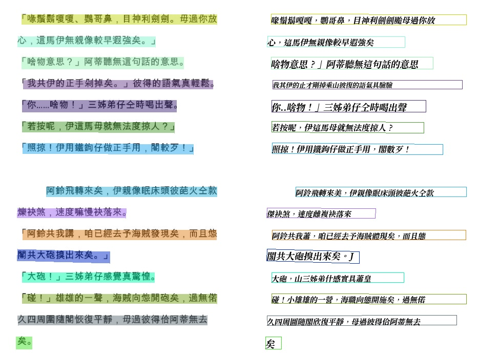
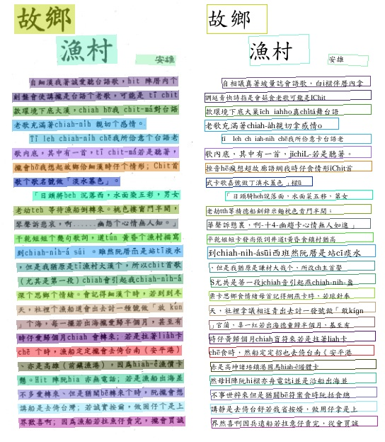

English | [Chinese](README_ch.md)

# Applications

Recognize and save Chinese,English , mixed Hanji, Tâi-lô and Peh-oe-ji characters as text files







# Installing

you can clone this git repo and install Docker images

```
git clone https://github.com/leon0719/taigiOCR.git
```

Using Docker image to build environment, install library, CUDA and CUDA Toolkit

```
#Create a folder to save pictures
mkdir img_data

docker run --gpus all -it --name OCR_ENV -v /path/to/taigiOCR:/workspace/ -v /path/to/img_data:/train_data/ --shm-size=120g --ulimit memlock=-1 leonhilty/ocr_search:v1.0.8 /bin/bash

```

Confirm that you are in the Docker environment


## Generating DATASET

Using tools/train_test_split.py to generate Chinese, English, Japanese, POJ, mixed Hanji and Tâi-lô characters and to cut the training set(90%) and validation set(10%).
and simulated test data

```
cd tools/
python get_data.py
```

Generating Results


Folder Trees

```
/train_data/
    (Simulation test data)
        ├── test (Validation set Img)
        ├── test_label.txt (Validation set Labels)
        ├── train (Training Set Img)
        └── train_label.txt (Training Set Labels)
```

## Training

Modify the PaddleOCR/configs/PP-OCRv3_rec.yml configuration file

|                         | Modify                                                                                |
| ----------------------- | ------------------------------------------------------------------------------------- |
| num_workers             | Number of GPUs                                                                        |
| character_dict_path     | Customized dictionary path e.x. ppocr/utils/dict/total_dic.txt                        |

Start training after modification

```
cd PaddleOCR
# Need to modify train.sh --gpus parameters e.x. 3 GPUs --gpus '0,1,2'
sh train.sh
```

If you temporarily interrupt training and want to continue, use re-train.sh to resume training

```
cd PaddleOCR
# Need to modify re-train.sh --gpus parameters
sh re-train.sh
```

The saved model and training directory will be available under the output directory after the training is completed

```
my_ocr_model/
├── best_accuracy.pdopt
├── best_accuracy.pdparams
├── best_accuracy.states
├── config.yml
├── latest.pdopt
├── latest.pdparams
├── latest.states
└── train.log
```

## Predicted results for each language

Using tools/Real_Test_predict.py to predict and calculate CERs for **test image data**.

```
cd tools/
python Real_Test_predict.py
```

Predicted results are saved in PaddleOCR/result

## Applications

Converting trained **text recognition** models into inference models

```
cd PaddleOCR
python3 tools/export_model.py -c configs/PP-OCRv3_rec.yml -o Global.pretrained_model=output/my_ocr_model/best_accuracy  Global.save_inference_dir=./rec_inference/
```

After conversion, it will be in the PaddleOCR/rec_inference directory.
Folder Tree

```
rec_inference/
├── inference.pdiparams
├── inference.pdiparams.info
└── inference.pdmodel
```

## How to predict the whole picture (text detection model + text recognition model)

Use PaddleOCR/tools/infer/predict_system.py to make predictions about the pictures

```
#Image Path --image_dir
#Font Path --vis_font_path
cd PaddleOCR
sh final_infere.sh
```

Prediction results are saved under the PaddleOCR/inference_results directory

## Reference

[1] [Paddleocr](https://github.com/PaddlePaddle/PaddleOCR)

[2] [Textrecognitiondatagenerator](https://github.com/Belval/TextRecognitionDataGenerator)
